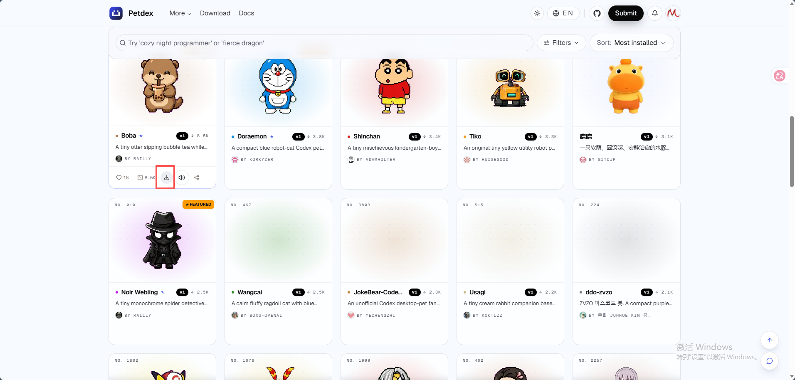
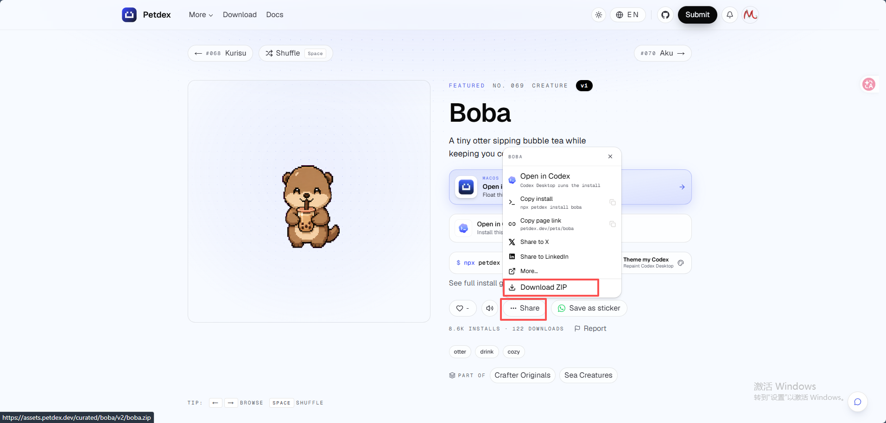
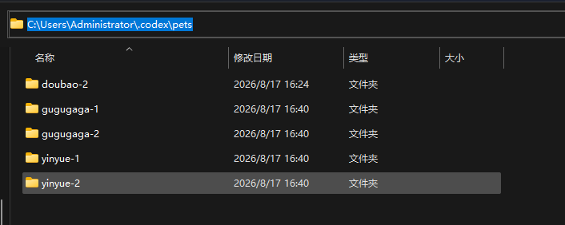
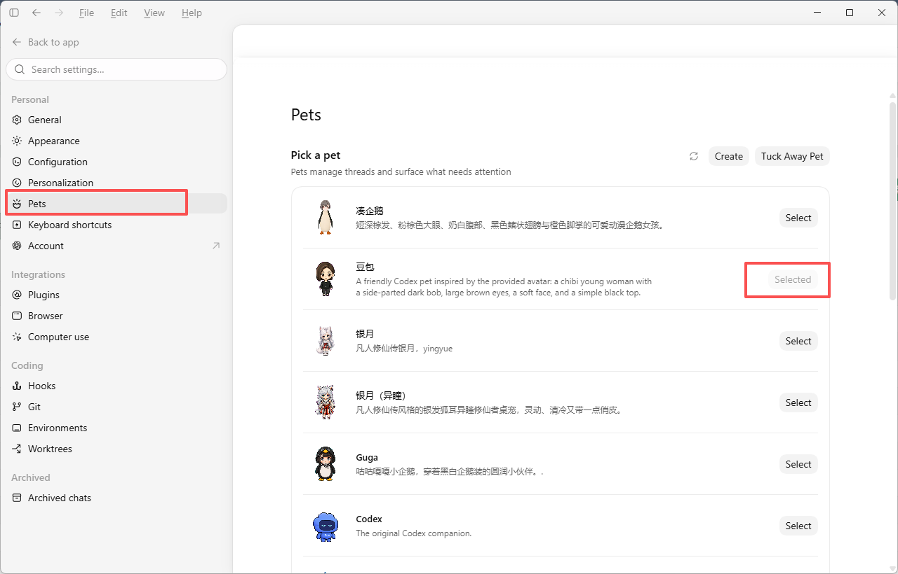
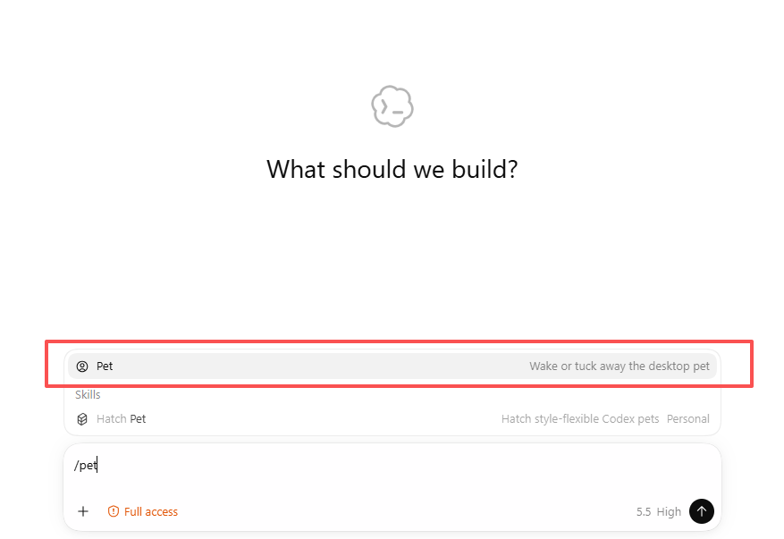

## ai-pets


Codex、Claude Code、DeepSeek Harness、Hermes、OpenCode、Gemini CLI 等的宠物


## 下载和配置pet


下载pet网站：   
https://petdex.dev/   
https://github.com/crafter-station/petdex   


下载压缩包   

或者   



解压到目标目录   



重启chatgpt（codex）   


在软件的pets中选择pet   



```/pet```唤醒或者收起【chatgpt有bug，这个开关有时候没反应】   

